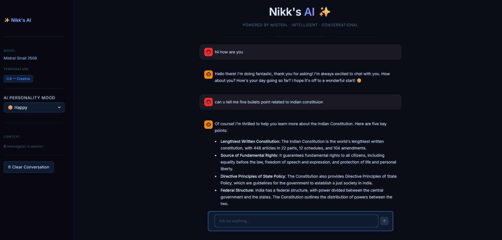
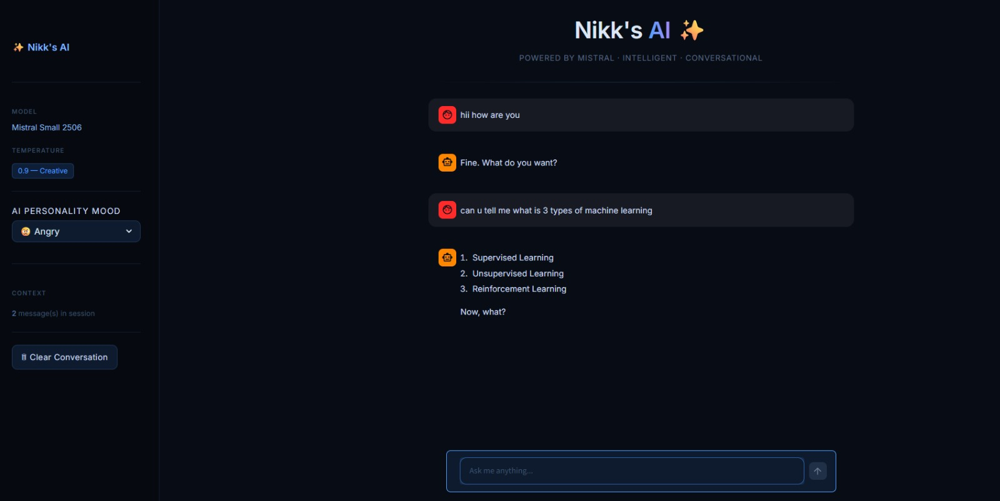
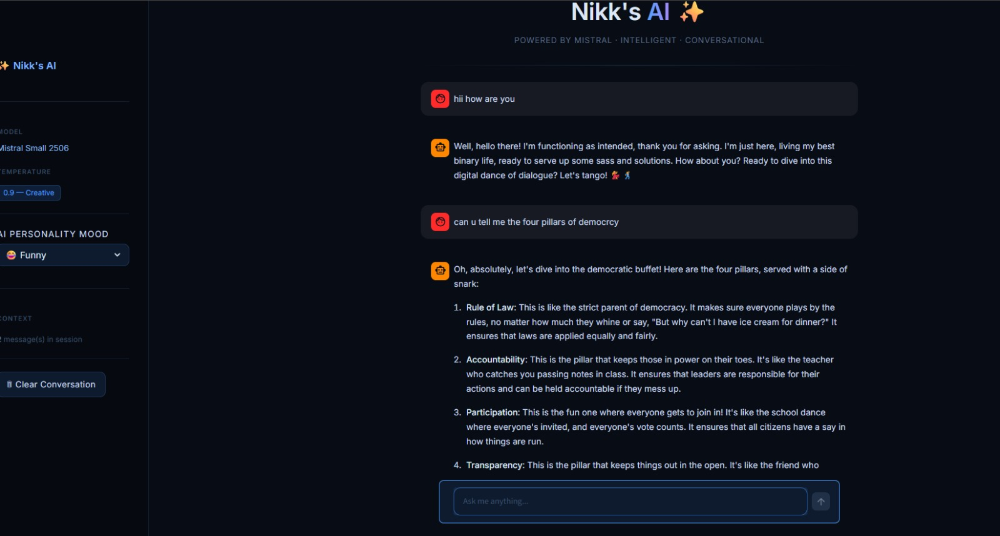
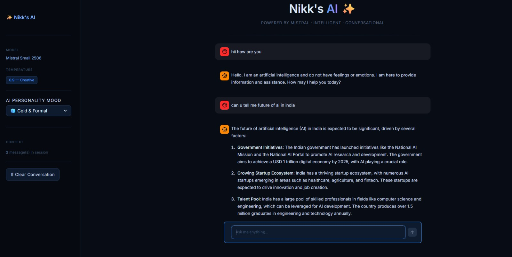

# Nikk's AI ✨

A futuristic AI chatbot with dynamic personality moods powered by Mistral AI and Streamlit.

---

## 🚀 Live Demo

🔗 https://nikks-ai-chatbot.streamlit.app

---

## ✨ Features

- 🤖 AI-powered conversational chatbot
- 😊 Happy personality mode
- 😢 Sad personality mode
- 😠 Angry personality mode
- 😂 Funny personality mode
- 🧊 Cold & Formal personality mode
- 🎨 Modern futuristic UI
- 🌙 Dark themed interface
- 💬 Real-time conversation memory
- ⚡ Powered by Mistral AI

---

# 📸 Screenshots

## 😊 Happy Mood



---

## 😠 Angry Mood



---

## 😂 Funny Mood



---

## 🧊 Cold & Formal Mood



---

## 🛠️ Tech Stack

- Python
- Streamlit
- LangChain
- Mistral AI
- HTML/CSS

---

## ⚙️ Run Locally

Clone the repository:

```bash
git clone https://github.com/AYUSHTIWARI7126/nikks-ai-chatbot.git
```

Install dependencies:

```bash
pip install -r requirements.txt
```

Create `.env` file:

```env
MISTRAL_API_KEY=your_api_key_here
```

Run the app:

```bash
streamlit run streamlit_app.py
```

---

# 👨‍💻 Author

Ayush Tiwari

Built with ❤️ using Streamlit and Mistral AI.
